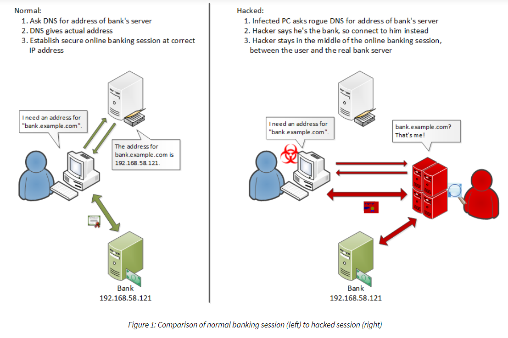

# DNS查询泄漏（经由DNS解析服务器）与MITM

## 什么是DNS泄露

- 在网络通信中，通信内容可以被加密，但是就像发送方与接收方地址无法被加密一样，由于某种原因，DNS流量不能被加密。因此网络活动会暴露给任何能接触到DNS服务器人，如网络服务提供商（ISP）

- 为了减轻上述问题，保护用户隐私，VPN技术得到应用，DNS请求和数据通过安全的VPN信道传输。这看似很安全，但一旦DNS请求泄露出安全信道，在非安全的信道传输。这会使你所有信息被路由到ISP，暴露你访问的所有网站的地址。

    

- 若ISP开启了DNS透明代理服务，那对ISP的DNS泄露似乎已成必然（虽然它的本意是为了负载均衡）。即使指定了特定地址的DNS服务器，ISP会用它的DNS服务器的地址替换你请求中的指定地址，迫使你使用它的DNS服务器。

    

## DNS泄露原因（win10)

- 从热点、WIFI和路由器切换Internet，当连接到新的网络时，Windows系统更喜欢由LAN网关托管的DNS服务器，而不是由VPN服务托管的DNS度武器。由局域网网关托管的DNS服务器会将所有地址发送给ISP

- VPN中缺乏对IPv6地址的支持。若果使用的VPN不支持IPv6地址，那么对IPv6地址的任何请求都会被发送到最初将IPv4转换为IPv6的通道。这种地址转换最终将绕过VPN安全通道，公开导致DNS泄漏的所有在线活动。

## 中间人攻击

- DNS没有为服务器提供对它们下推到客户机的数据提供身份验证细节的机制，接受者无法验证数据来源及其完整性

- 解析器只能使用DNS服务器的源IP地址、目的端口号和源端口号以及DNS事务ID来验证DNS应答包，攻击者可以轻松构造一个DNS服务器响应包来匹配这些参数

- DNS欺骗

    - 攻击者对目标进行ARP缓存投毒，成功后目标的流量被重路由到攻击者主机，攻击者能收到目标发出的DNS请求，攻击者分析DNS请求包，得到DNS请求的ID（此ID关联DNS请求与回复），再构造一个具有相同ID的恶意DNS回复包。这样目标就会访问攻击者希望他访问的网站，而不是他自己期望的访问。

    

    - DNS欺骗小实验

        - 工具：ettercap

        - 靶机IP：10.0.2.13  
          
        - 攻击者IP：10.0.2.11

        - 在攻击者的`/etc/ettercap/etter.dns`中添加一项`www.baidu.com  A  10.0.2.11`

        - DNS欺骗前靶机ping百度，显示的百度IP正常

            

        - 在攻击主机执行 `ettercap -i eth1 -Tp -M arp:remote -P dns_spoof /10.0.2.13 ` 对靶机进行arp投毒

        - DNS欺骗后靶机ping百度,百度的IP地址显示为攻击主机的IP

            

- 新型中间人攻击示意图

    

    - 攻击者使用垃圾邮件发送恶意软件，这些恶意软件更改DNS设置并安装流氓证书颁发机构(CA)的证书。DNS更改指向攻击者的秘密DNS名称服务器，以便用户被定向到攻击者的代理服务器，而不是合法站点。基于CA，用户的PC信任攻击者的代理服务器，不提供攻击发生的任何指示。浏览器会显示正确的网站名称，并显示熟悉的安全图标，以指示可信的、安全的连接。

# 引用
- [Security vulnerabilities in DNS and DNSSEC](http://web.mit.edu/6.033/www/papers/dnssec.pdf)

- [What is a DNS leak and how to Stop DNS leak](https://www.thewindowsclub.com/what-is-dns-leak)

- [透明代理](http://support.huawei.com/hedex/pages/EDOC1000133828DZD0429D/13/EDOC1000133828DZD0429D/13/resources/ag_cn/sec_eudemon_ag_network_0048_04.html)

- [New Man-in-the-Middle attacks leveraging rogue DNS](https://info.phishlabs.com/blog/new-man-in-the-middle-attacks-leveraging-rogue-dns)

- [DNS Spoofing](http://techgenix.com/understanding-man-in-the-middle-attacks-arp-part2/)

- [DNS欺骗实战](https://www.cnblogs.com/aq-ry/p/9379463.html)

