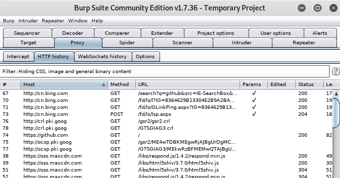

# WPAD中间人劫持

## WPAD功能

- WPAD ： Web代理自动发现协议，该协议的功能是可以使局域网中的用户浏览器可以自动发现内网中的代理服务器，并使用已发现的代理服务器连接互联网或企业内网

## WPAD工作原理

- 当系统开启了代理自动发现功能后，用户使用浏览器上网时，浏览器就会在当前局域网中自动查找代理服务器，如果找到了代理服务器，则会从代理服务器中下载一个名为PAC(Proxy Auto-Config)的配置文件。该文件中定义了用户在访问一个URL时应该使用的代理服务器。浏览器会下载并解析该文件，将相应的代理服务器设置到用户的浏览器中。因此正确PAC文件的获取至关重要

- 一个PAC文件至少定义了一个 ` FindProxyForURL(url, host) ` 函数，该函数的返回值指定了URL的访问方式

        function FindProxyForURL(url, host) {
        if (url== 'http://Her0in.org/') return 'DIRECT';
        if (shExpMatch(host, "*.wooyun.org")) return "DIRECT";
        if (host== 'wooyun.com') return 'SOCKS 127.1.1.1:8080';
        if (dnsResolve(host) == '10.0.0.100') return 'PROXY 127.2.2.2:8080;DIRECT';
        return 'DIRECT';
        }
    - 该文件定义了当用户访问 http://Her0in.org/ 时，将不使用任何理服务器直接（DIRECT）访问 URL

    - PROXY 127.2.2.2:8080;DIRECT 指定了使用 127.2.2.2:8080 的 HTTP 代理进行 URL 的访问，如果连接 127.2.2.2:8080 的 HTTP 代理服务器失败，则直接（DIRECT）访问 URL。

- 原理图

    

## WPAD实现方式

- 通过DHCP服务器

    

    - web浏览器通过向DHCP服务器发送 `DHCP INFORM` 查询PAC文件位置

    - DHCP服务器返回 `DHCP ACK` 数据包，包含PAC文件的位置

    - 目前内网中已不再使用DHCP服务器来对客户端的WPAD配置

- 通过DNS查询

    1. 客户端向DNS服务器发起了 `WPAD+X` 的查询请求

    2. DNS 服务器对WPAD 主机的名称进行解析，返回WPAD主机的IP地址

    3. 客户端主机通过WPAD主机的IP地址的80端口下载并解析PAC文件

- 通过LLMNR协议(DNS查询失败)


    - LLMNR名称解析过程
    
        
    
    - 缺陷
        1. 整个过程走UDP协议，主机A根本不知道它得到的IP是不是它想要解析的主机的IP地址
    
        2. 无论局域网中存不存在主机B，只要主机A请求主机B，都会进行一次LLMNR解析过程

- NBNS 查询(LLMNR查询失败)

## WPAD中间劫持原理

-  攻击者将自己加入到组播组中，当主机A发起对主机B的名称解析，使用UDP协议广播，攻击者收到这个请求后，对主机A进行“恶意”应答

- 若主机A的浏览器设置为`自动检测代理`，攻击者宣称自己就是wpad服务器，那么主机A就会从攻击者这里下载攻击者事先准备好的PAC文件，通过攻击者为它“准备”的代理服务器访问url

    

    


### 顺序
    DNS >= LLMNR >= NBNS

## WPAD劫持实验
### 实验环境

- 虚拟机:virtual box 5.2.18 r124319
  - 攻击者:4.17.0-kali1-amd64

  - 靶机:Windows 7

### 实验流程

#### 网络拓扑


####  1. 在Attacker污染NBNS查询

- 进入metasploit控制台
    ```
    service postgresql start
    msfconsole
    ```
    

- 监听NBNS查询
    ```
    use auxiliary/spoof/nbns/nbns_response 
    set regex WPAD 
    set spoofip 10.0.2.5
    run
    ```
    	

- 设置WPAD服务器
    ```
    use auxiliary/server/wpad 
    set proxy 10.0.2.5 
    run
    ```
    

#### 2. 在Attacker使用Burp Suite开启代理服务

- Proxy->Options设置如下图所示的代理，不选择loopback only
  
    
  
- Proxy->Intercept关闭Intercecpt按钮

    

#### 3. 在Victim访问互联网
- 攻击前能正常访问http://sec.cuc.edu.cn

  

  攻击前能正常访问https://sec.cuc.edu.cn

  

  原始证书信息如下

  

- 在Internet 选项中确保勾选自动检测设置

 	

- 攻击后访问http://sec.cuc.edu.cn提示证书有问题

  

- 把http改为https后整个页面都提示证书有问题，选择继续浏览此网站

  

- 继续浏览可见地址栏提示证书错误

  

- 查看证书如下，原来的证书已被替换

  

- 访问百度效果类似
  - 提示证书有问题，选择继续浏览此网站

  

  - 地址栏处显示证书错误

  

  - 证书如下

  

#### 4. 在Attacker查看截获流量并分析抓包结果

- 首先在Burp Suite中可以看到所有靶机访问产生的流量，可进行进一步利用

	
	
	

主机在靶机访问网络前已经开始抓包

- 靶机NBNS广播包

	

- 攻击者主机对靶机NBNS广播的回复包

	
	
- 靶机向攻击者请求PAC文件

	
	
- 攻击者回复的PAC文件

	

#### 错误分析

- 刚开始自己构建了PAC文件，在本地/var/www/html/路径下创建了文件wpad.dat,内容如下，Burp Suite也配置了10.0.2.5:1080的代理，但是靶机上不了网

  

  然后抓包发现攻击者主机回复的PAC文件不是我提前编辑好的wpad.dat，而是回复了 [本机IP:8080] 作为代理服务器地址,如下图，所以猜想metasploit framework应该是自动回复了wpad.dat,所以在实验中直接改了Burp Suite代理的端口为8080继续实验

	

## 参考

- [基于WPAD的中间人攻击](https://juejin.im/post/5aa11887518825558a062dcf)
- [starting-metasploit-framework-in-kali](https://docs.kali.org/general-use/starting-metasploit-framework-in-kali)
- [Using WPAD to Compromise Web Browsers / How To Protect Yourself at Starbucks!](https://www.youtube.com/watch?v=1ab8vBjUr6I)

