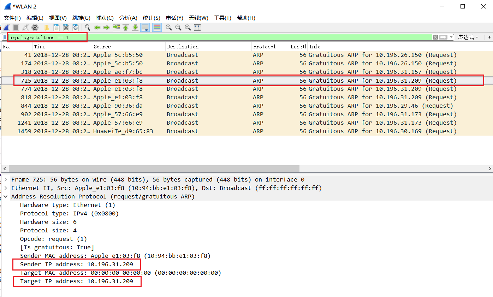
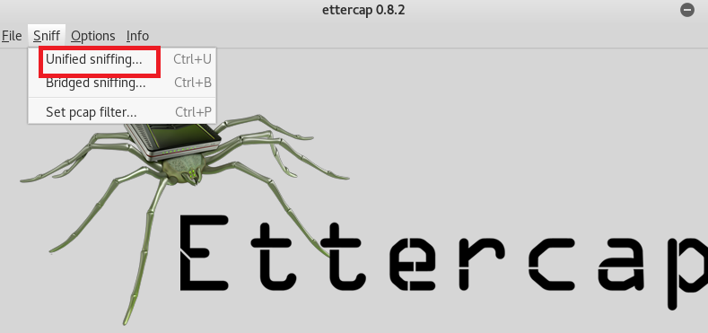

# ARP欺骗与MITM
## 基本理论
### 1. ARP （Address Resolution Protocol）地址解析协议
- 功能：通过网络地址来解析MAC地址
- 原理:
    - 装有TCP/IP协议的计算机和路由器都维护一个ARP缓存表，一段时间如果某个表项没有被使用即被删除，以减小ARP表长度

    - 在主机发送数据使，先在ARP缓存表中寻找是否有目标IP地址，若未找到就发送ARP request，目标MAC地址填为 ff:ff:ff:ff:ff:ff，在子网内进行广播。此时只有ip地址为目标ip的主机做出响应，给发起询问的主机回复ARP response

    - Gratuitous ARP ：无故arp，当设备配置了静态ip地址或者通过dchp获取ip地址之后发起

         作用:

         1. 检查重复地址和ip地址冲突
         2. 通告一个新的数据链路标识，设备收到ARP请求时，若ARP缓存中已有发送者ip地址，则更新对应的MAC地址条目

### 2. ARP欺骗

- 原理：攻击者构造假的ARP数据包发送给靶机，宣称网关ip地址对应的mac地址为攻击者自己的mac地址，使得靶机ARP表中存在错误的的表项，此后靶机发送至网关的数据包就会直接发送到攻击者主机上。此时便阻断了靶机与网关的通信。如果攻击同时对网关进行ARP欺骗，则可以在网关和靶机正常通信的情况下，获得所有通信流量。

- 防制方法：

    - 终端用户角度：

      - 安装桌面型防火墙
      - 配置静态的ARP表
      - 敏感数据加密后在传输并使用加密通信协议

    - 网络管理员角度：

      - 交换机端口安全机制

        DAI(Dynamic ARP Inspection)技术:根据DAI检测表检测交换机每个端口的接收到的arp回应包,若违规则丢弃此数据包.DIA检测表的获取有两种方式:

        1. 手工静态绑定
        2. 在交换机上开启DHCP snooping，当用户第一次通过DHCP获取到地址的时候，交换机就把用户电脑的IP、MAC、Port信息记录在DHCP侦听表，后面ARP检测直接调用这张DHCP侦听表即可。

        > In the Cisco IOS realm, note that other switch security services such as IP source guard and dynamic ARP inspection will use the DHCP snooping database, although it is possible to configure IPSG and DAI to function using static entries.

      - 通过划分更小的 VLAN 来限制 ARP 欺骗的影响范围，极端情况下就是每个局域网主机相互均不可见：每个主机只有互联网访问权限、ARP 广播只能网关收到，无法影响到局域网内其他主机

## 实验

### 1. 查看Gratuitous ARP

- 分析pcapr.net中一[样本包](http://www.pcapr.net/view/ankitshakya007/2014/1/5/15/arp_gratuitous.pcap.html)，其中仅有一个无故ARP包，包中将自己的ip地址作为目标ip地址，用于宣告自己即将使用某个 IP-MAC 地址对。如有主机提出反对，就会回应一个目标主机是 GARP 发送者 MAC 地址的 GARP-reply 包，告知 GARP 发送者这个 IP 我已经在使用了，你再使用就会引起 IP 地址冲突，该样本包中未体现。

	
  
- 尝试直接抓包分析观察：使用wireshark在局域网内抓包，过滤条件设置为`arp.isgratuitous == 1`, 结果和样本包类似
  ​    	 	
    

- 由于在上述两次抓包中都没有发现无故arp的回复包，所以在pcapr上找了[样本包2](http://pcapr.net/view/bwilkerson/2008/10/3/12/dot1q.pcap.html)观察，可发现出现ip冲突时，原ip使用者会回复无故ARP发送者，包中发送方和接受方ip相同。

    

### 2. 使用arpspoof实现中间人攻击

- 网络拓扑

- 连通性测试

    
- 查看ARP表

    

#### 引流阶段
- 在Attacker执行 `arpspoof -i eth0 -t 192.168.0.2 192.168.0.254`对对靶机进行arp投毒

    
- 查看靶机arp表发现网关ip对应的mac地址已经被替换，且靶机无法上网。此时已经阻断了靶机和网关的通信

    
- 在攻击者主机开启另一终端对网关进行arp投毒
    - 执行 `arpspoof -i eth0 -t 192.168.0.254 192.168.0.2`
    - 执行 `echo 1 > /proc/sys/net/ipv4/ip_forward` 开启转发功能

    执行后分别查看网关和主机的arp表，发现都已被污染，且靶机能正常上网

    

#### 获取通讯负载

- 在主机端使用wireshark抓包，然后在靶机尝试登录学校网站，显示登录异常

    

- 分析数据包，可找到登录的账号密码原文，至此成功实现中间人攻击。

    

- 对登录异常原因进行探究

  - 在靶机未被arp投毒前尝试登录，发现仍然出现登录异常，查看http状态码为302（ Moved Temporarily ）
  
  	
  - 在宿主机上尝试访问学校官网登录也出现登录异常，所以此处登录入口应该是已经弃用了，这个测试点选择的不是很好

  	
  	
  	

- 尝试攻击者通过重发Cookie实现实现靶机账户登录（由于上述登录入口不可用，下面选择使用登录教务在线）

    - 主机端开启wireshark抓包

    

    - 靶机登录教务在线

    
    
    - 主机中选择一http包，右键选择Follow->TCP stream，拷贝Cookie

    

    - 使用firefox插件 simple modify headers，设置自动更改cookie选项，点击start

    

    - 刷新教务在线页面，没有成功登入

      排错：

      - 查看了Network发现已经把Cookie更改为我设置的Cookie，所以插件功能应该没有问题

        

	  - 结合老师上课给出的实验视频和之前同学成功重发cookie的实验报告，用相同方法还尝试了登录qq邮箱，新浪微博，并且在过滤包时用的过滤条件为`http.cookie contains qq`格式，还是没有成功登入

### 3. 使用ettercap实现中间人攻击

网络拓扑和arpspoof一致，ettercap也实现了同样的效果
- kali直接搜索ettercap

    
- 开始嗅探，如下图

    

- 发现局域网内存在的主机

    

    添加为目标

    

- 开始中间人攻击

    

- 效果和arpspoof相同

## 参考
- [Man In The Middle Attack! (ARP Poisoning) using ettercap to sniff login information](https://www.youtube.com/watch?v=0a7o9FKzWOc)
- [Arpspoof工具](https://wizardforcel.gitbooks.io/daxueba-kali-linux-tutorial/content/58.html)
- [ARP欺骗](https://zh.wikipedia.org/wiki/ARP%E6%AC%BA%E9%A8%99)
- [DHCP_snooping](https://zh.wikipedia.org/wiki/DHCP_snooping)
- [five-things-to-know-about-dhcp-snooping](https://packetpushers.net/five-things-to-know-about-dhcp-snooping/)
- [图解ARP协议（三）ARP防御篇-如何揪出"内鬼"并"优雅的还手"-知乎](https://zhuanlan.zhihu.com/p/28865553)