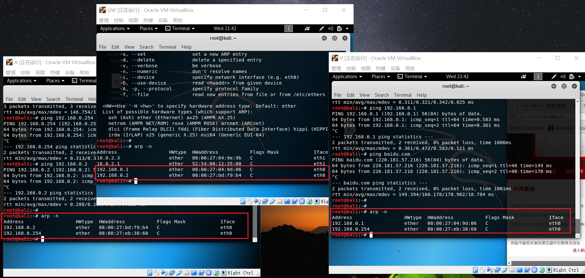

# ARP欺骗与MITM
## 基本理论
### 1. ARP （Address Resolution Protocol）地址解析协议
- 功能：通过网络地址来解析MAC地址
- 原理:
    - 装有TCP/IP协议的计算机和路由器都维护一个ARP缓存表，一段时间如果某个表项没有被使用即被删除，以减小ARP表长度
    - 在主机发送数据使，先在arp缓存表中寻找是否有目标IP地址，若未找到就发送ARP request，目标MAC地址填为 ff:ff:ff:ff:ff:ff，在子网内进行广播。此时只有ip地址为目标ip的主机做出响应，给发起询问的主机回复ARP response
    - Gratuitous ARP也称为免费ARP，无故ARP。 Gratuitous ARP是 一种特殊的arp请求，是在主机启动的时候请求自己ip地址的mac地址。用于确定该ip是否已被占用，也可用于更新arp表

### 2. ARP欺骗
- 原理：攻击者构造假的ARP数据包发送给靶机，宣称网关ip地址对应的mac地址为攻击者自己的mac地址，使得靶机arp表中存在错误的的表项，此后靶机发送至网关的数据包就会直接发送到攻击者主机上。此时便阻断了靶机与网关的通信。如果攻击同时对网关进行arp欺骗，则可以在网关和靶机正常通信的情况下，获得所有通信流量。

- 防制方法
    1. 最理想的方法是网络内的每台计算机的ARP一律改用静态的方式，但是在大型的网络中不可行的，因为需要经常更新每台计算机的ARP表。
    2. 网络设备可借由DHCP保留网络上各计算机的MAC地址，例如DHCP snooping
        - 交换机上配置dhcp snooping，将交换机上端口设置为信任和非信任状态，交换机只转发信任端口的 DHCP OFFER/ACK/NAK报文（DISCOVER报文正常转发）
        -  DHCP Snooping 还会监听经过本机的 DHCP 数据包并生成 DHCP Binding Table 记录表，一条记录包括 IP、MAC、租约时间、端口、VLAN、类型等信息，结合 DAI(Dynamic ARP Inspection)和 IPSG(IP Source Guard)可实现ARP防欺骗和IP流量控制功能。
- 用途
    - ARP欺骗亦有正当用途。其一是在一个需要登录的网络中，让未登录的计算机将其浏览网页强制转向到登录页面，以便登录后才可使用网络。另外有些设有备援机制的网络设备或服务器，亦需要利用ARP欺骗以在设备出现故障时将讯务导到备用的设备上。

## 实验
### 网络拓扑

### 1. 使用arpspoof
- 连通性测试

    
- 查看arp表

    
- 在Attacker执行 `arpspoof -i eth0 -t 192.168.0.2 192.168.0.254`对对靶机进行arp投毒

    
- 查看靶机arp表发现网关ip对应的mac地址已经被替换，且靶机无法上网。此时已经阻断了靶机和网关的通信

    
- 在攻击者主机开启另一终端对网关进行arp投毒
    - 执行 `arpspoof -i eth0 -t 192.168.0.254 192.168.0.2`
    - 执行 `echo 1 > /proc/sys/net/ipv4/ip_forward` 开启转发功能

    执行后分别查看网关和主机的arp表，发现都已被污染，且靶机能正常上网

    

- 在主机端使用wireshark抓包，然后在靶机尝试登录学校网站，显示登录异常

    

- 分析数据包，可找到登录的账号密码原文，至此成功实现中间人攻击。

    

### 2. 使用ettercap
网络拓扑和arpspoof一致，ettercap也实现了同样的效果
- kali直接搜索ettercap

    
- 开始嗅探，如下图

    

- 发现局域网内存在的主机

    

    添加为目标

    

- 开始中间人攻击

    

- 效果和arpspoof相同

## 参考
- [Man In The Middle Attack! (ARP Poisoning) using ettercap to sniff login information](https://www.youtube.com/watch?v=0a7o9FKzWOc)

- [Arpspoof工具](https://wizardforcel.gitbooks.io/daxueba-kali-linux-tutorial/content/58.html)
- [ARP欺骗](https://zh.wikipedia.org/wiki/ARP%E6%AC%BA%E9%A8%99)
- [DHCP_snooping](https://zh.wikipedia.org/wiki/DHCP_snooping)