# 伪造证书

## HTTPS连接建立

1. Client Hello

    - 支持的协议版本，如 TLS1.0

    - 一个客户端生成的随机数，后面用于生成‘对话密钥’

    - 支持的加密方法，如RSA公钥加密；支持的压缩算法等
   
2. ServerHello

    - 确认使用的加密通信协议版本，如TLS1.0

    - 一个服务器生成的随机数，稍后用于生成‘对话密钥’

    - 确认使用的加密方法，压缩算法等

    - 服务器公钥证书

3. 客户端收到服务器的回应后，首先检查服务器证书的有效性（根证书内嵌在客户端），如果无效则向访问者警告，由其选择是否还要通信。如果有效则提取出服务器公钥，并继续响应：
    - 一个随机数，用服务器公钥加密；编码改变通知，表示随后信息都将用双方商定的加密方法和密钥发送

    - 客户端握手结束通知。发送前面发送的所有内容的hash值，用来供服务器校验

4. 服务器收到客户端的第三个随机数后，计算本次会话的‘会话密钥’（对称密钥），并向客户端发送：

    - 编码改变通知，表示随后信息都将用双方商定的加密方法和密钥发送

    - 握手结束通知。发送前面发送的所有内容的hash值，用来供客户端校验

### 过程中服务器可以提出要求验证客户端身份真实性

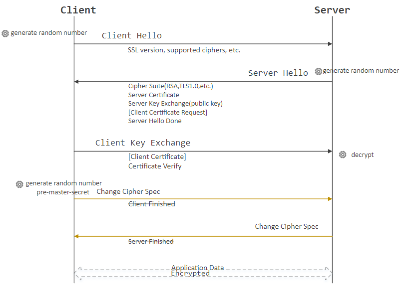

## 中间人攻击

### 攻击原理

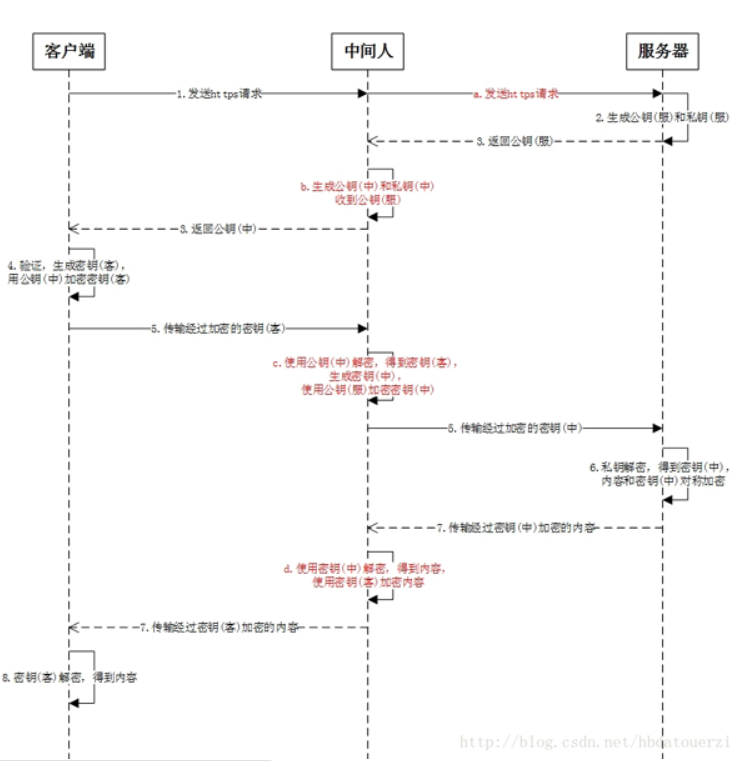

## 伪装证书与中间人攻击

### 工具 sslsplit

### 靶机

- IP : 10.0.2.13

- 路由表

    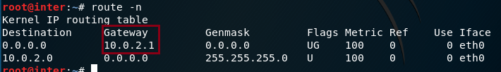

- ARP

    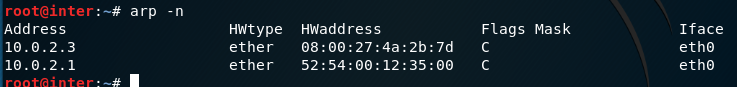

### 攻击者

- IP ：10.0.2.11

## 攻击过程

1. 攻击者生成自签名证书

    - 私钥，以后用来签名伪造证书

    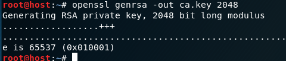

    - 生成CA证书，用来验证伪造证书

    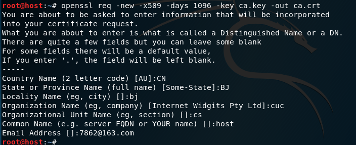

2. 攻击者开启路由转发

    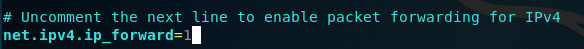

3. 攻击者配置iptables规则
    
    - 发给80端口的流量转发给8080端口

         `iptables -t nat -A PREROUTING -p tcp --dport 80 -j REDIRECT --to-ports 8080`

    - 发给443端口的流量转发给8443端口

         `iptables -t nat -A PREROUTING -p tcp --dport 443 -j REDIRECT --to-ports 8443`

4. 攻击者对靶机实行ARP欺骗

- 欺骗前

    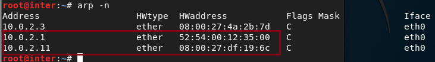

- 欺骗后，网关mac地址变成攻击者mac地址

    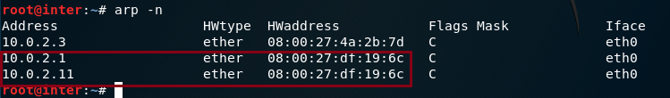

5. 攻击者启动sslsplit,对流量进行日志记录

    `sslsplit -D -l connect.log -j /root/test -S /root/test/logdir -k ca.key -c ca.crt ssl 0.0.0.0 8443 tcp 0.0.0.0 8080 `

6. 靶机访问

- 访问github

    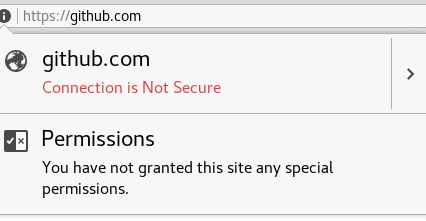

    - 若事先攻击者能将自己的CA证书安装到客户端便没有这个警告

- Add Exception后可正常访问github（攻击需要用户配合）

- 攻击者获取的信息

    - 通过真实证书信息伪造证书

     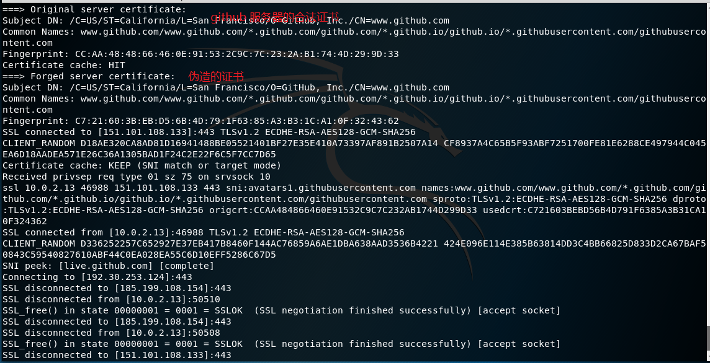

    - 通信信息(靶机登陆github)

     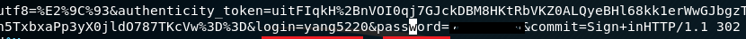

## 伪造证书实现中间人攻击的条件

- 对靶机进行ARP欺骗，进行流量劫持

- 靶机用户的安全意识很薄弱，对浏览器弹出的警告置之不理，即攻击需要受害者配合

- 将用于签名伪造证书的私钥所对应的公钥证书提前安装到目标机器，这种情况下没有警告弹出，攻击成功率较高

## 另类伪造证书

- 权威CA自行为某域名签发证书，由于用户浏览器内置受信任CA的根证书，此时进行中间人攻击毫无察觉

- 针对此类伪造证书，提出了Certificate Transparecy(证书透明度)系统用于记录、审计和监控CA颁发的证书

    - 组成部分
        - 证书日志
        - 证书监视
        - 证书审计
    - 要求CA公开宣布其颁发的每一个数字证书，即将其记录到证书日志中，可以给用户查找
    - 证书记录只能被添加，不能被删除、修改、追溯的将数据插入日志
    - 证书日志使用‘Makle Tree Hashes’加密机制防止被篡改
    - 公开审计，任何人都可以查询日志，或者验证颁发的数字证书是否已经合理的记录在日志中
    - 此方法虽然不能阻止CA伪造证书，但能帮助用户尽快发现伪造的证书

        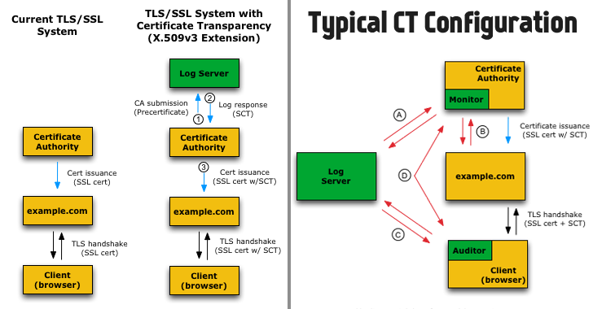

# 引用

- [如何应对伪造的SSL证书](https://www.freebuf.com/vuls/101479.html)

- [SSL中间人证书攻击](https://www.freebuf.com/sectool/48016.html)

- [SSL/TSL原理详解](https://segmentfault.com/a/1190000002554673)

    

    

